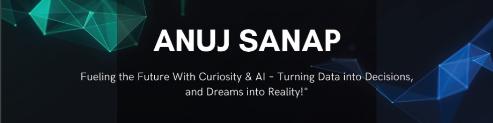

<!-- Professional, Modern & Futuristic GitHub Profile README for Anuj Sanap -->

<!-- Wave Header -->
<p align="center">
  
</p>

<h3 align="center">
  <a href="https://git.io/typing-svg">
    
  </a>
</h3>

<!-- Coding GIF -->
<p align="center">
  
</p>

---

## 🌟 About Me  

> *“Code is my way of turning ideas into impact.”*  
> *“Every bug is just a step toward innovation.”*  
> *“I see technology as a bridge to the future.”*  

I am **Anuj Sanap**, a passionate **Computer Engineering enthusiast** with **curiosity, discipline, and creativity**.  
From solving logical challenges and building projects to hackathons and research, I enjoy turning **complex problems into simple solutions**.  

💡 My interests span across:  
- **Software Development**  
- **Machine Learning & AI**  
- **Web & App Development**  
- **Cybersecurity**  

---

## ⚡ Skills & Tools  

<p align="center">
  
</p>

<table align="center">
<tr>
<td align="center" width="33%"><b>Languages</b><br>Java · Python · C · C++ · JavaScript</td>
<td align="center" width="33%"><b>Databases</b><br>MySQL · Firebase · SQLite</td>
<td align="center" width="33%"><b>Development</b><br>VS Code · IntelliJ · Android Studio</td>
</tr>
<tr>
<td align="center" width="33%"><b>Front-End</b><br>HTML · CSS · React · UI/UX Basics</td>
<td align="center" width="33%"><b>AI/ML</b><br>ML Models · Data Analytics · Automation</td>
<td align="center" width="33%"><b>Soft Skills</b><br>Problem Solving · Adaptability · Teamwork · Creativity</td>
</tr>
</table>

---

## 🚀 Featured Projects  

| Project | Description | Highlights |
|---------|-------------|------------|
| **AI Caption Generator** 🖼 | Flask-based app that generates captions & hashtags for images | 🤖 Image-to-Text · 📝 Auto-Captions · 📊 Social Media Ready |
| **Fertilizer Optimizer** 🌱 | ML-powered system for recommending sustainable fertilizer usage | 🌍 Higher Yield · ♻️ Sustainable Farming · 📈 Data-Driven Insights |
| **Transport App (Expo)** 🚚 | Parcel delivery system inspired by Porter | 📦 Create & Track Parcels · 📍 Location Based · 📲 User-Friendly |
| **LuxVintage (E-Commerce)** 🚗 | Vintage car store website | 🛒 Modern UI · 💳 Secure Payments · 🚀 Scalable |
| **Smart Billing System** 📑 | Stock & payment tracking system for businesses | 💡 Bills · 📊 Reports · ✅ Customer Records |

---

## 🏆 Achievements  

- 🎯 Built multiple **end-to-end projects** in AI, Web & Mobile.  
- 📖 Research-focused on **sustainable farming solutions**.  
- 🏅 Active participant in **hackathons & technical events**.  

---

## 📜 Certifications  

✔️ **Machine Learning Basics**  
✔️ **Web Development (React & Node.js)**  
✔️ **Cybersecurity Fundamentals**  
✔️ **Android Development**  

---

## 📊 GitHub Stats  

<p align="center">
  
</p>

<p align="center">
  
</p>

<p align="center">
  
</p>

---

## 🌐 Connect with Me  

<p align="center">
  <a href="mailto:anujsanap@gmail.com">
    
  </a>
  <a href="https://linkedin.com/in/anujsanap" target="_blank">
    
  </a>
  <a href="https://github.com/anujsanap" target="_blank">
    
  </a>
  <a href="https://leetcode.com/u/anujsanap/" target="_blank">
    
  </a>
</p>

---

## ⚡ Dev Mantra  

```java
// Code. Learn. Repeat.
// Failures are just commits to a bigger success.

while(true) {
   learn();
   build();
   debug();
   if(fail) retry();
}
